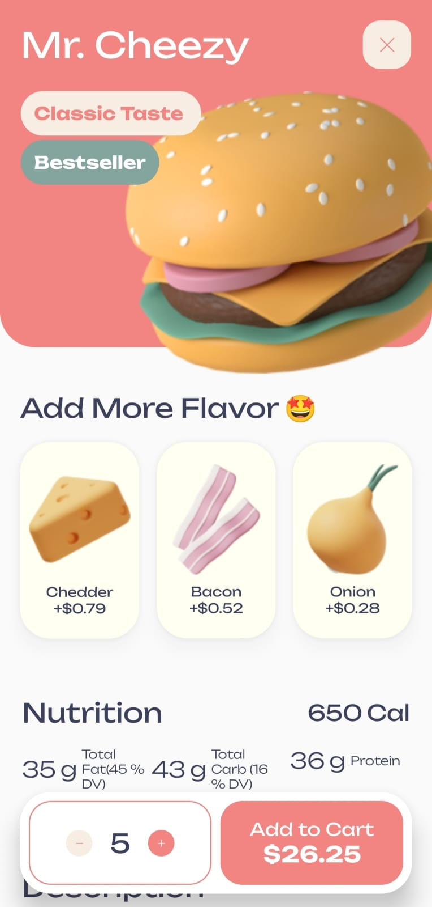
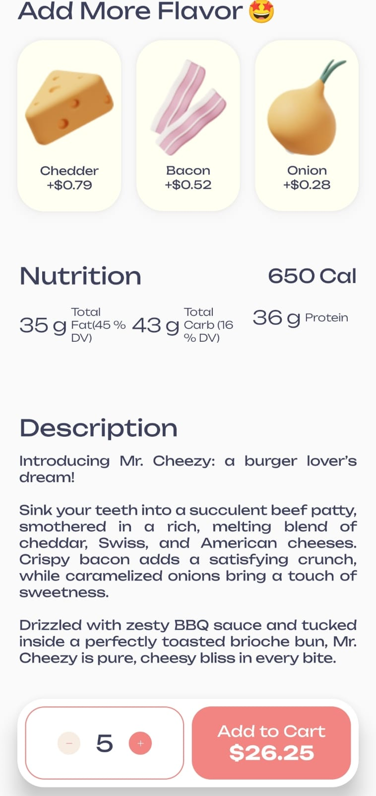

# Food-Delivery

Bu proje, modern Android geliştirme araçları olan **Kotlin** ve **Jetpack Compose** kullanılarak geliştirilmiş bir **burger sipariş arayüzü** tasarımıdır. Kullanıcı dostu, sade ve estetik bir arayüzle ürün tanıtımı, ekstra malzeme ekleme, besin bilgileri gösterimi ve sepete ekleme işlevleri örneklenmiştir.

## 📱 Ekran Görüntüleri

### Ana Arayüz

### Alternatif Arayüz / Diğer Görsel

## 🛠 Kullanılan Teknolojiler

- 💻 **Kotlin**
- 🎨 **Jetpack Compose**
- 🧱 **ConstraintLayout (Compose için)**
- 🖼 **Drawable Resources** ile görsel kullanımı
- 📦 **Composable Functions** ile modüler yapı

## 🚀 Özellikler

- **Ürün Başlığı**: Burgerin adı ve açıklayıcı etiketler (örneğin: Classic Taste, Bestseller)
- **3D Ürün Görseli**: Burgerin görsel sunumu
- **Ekstra Malzeme Seçimi**: Cheddar, Bacon, Onion gibi opsiyonlar ve fiyatları
- **Besin Bilgileri**: Kalori, yağ, karbonhidrat ve protein değerleri
- **Adet Seçimi**: Sayı arttırma/az
